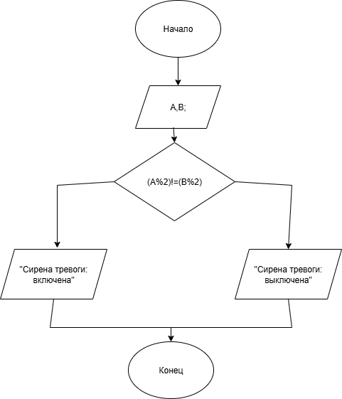

# homework3.2

### Условие задачи

Четный индикатор

Прибор на заводе имеет две контрольные лампы, соответствующие значениям датчиков A и B. Сирена тревоги должна загораться, если ровно одна из ламп показывает нечетное значение. Запишите условие для включения сирены.

### Алгоритм
1. **Начало**
2. Задать исходные данные:
   - `A` - значение первой лампы.
   - `B` - значение второй лампы.
3. Условие:
   `(A % 2) != (B % 2)`
4. Вывод нужного действия:
   - Если положительно - `"Сирена тревоги: включена`.
   - Если отрицательно - `"Сирена тревоги: выключена`.
5. **Конец**

### Блок-схема
!

([https://app.diagrams.net/?page-id=vKg7L8X21BIwSFlcxruJ#HIvan-Gus%2Fhomework3.2%2Fmain%2F%D0%97%D0%B0%D0%B4%D0%B0%D0%BD%D0%B8%D0%B53.2.drawio#%7B%22pageId%22%3A%22vZteqD_ion0vJN0eIRFN%22%7D]
(https://viewer.diagrams.net/?tags=%7B%7D&lightbox=1&highlight=0000ff&edit=_blank&layers=1&nav=1&title=%D0%97%D0%B0%D0%B4%D0%B0%D0%BD%D0%B8%D0%B53.2.png&dark=auto#R%3Cmxfile%3E%3Cdiagram%20name%3D%22%D0%A1%D1%82%D1%80%D0%B0%D0%BD%D0%B8%D1%86%D0%B0%20%E2%80%94%201%22%20id%3D%22vZteqD_ion0vJN0eIRFN%22%3E7ZrNcpswEICfpQdm0kMzgADbR9s4aTuTJp0cmhypUYAZjFxZjnGfvgtIIASOHf%2FFTnNhtCtphXY%2FrRclGhpO0mvqTcMb4uNYM3U%2F1ZCrmWZXN%2BCZKZaFwjAMvdAENPK5rlLcR38xV4ph88jHs9pARkjMomldOSZJgsespvMoJYv6sCcS11edegFuKO7HXtzU%2Fop8FvJ9mZ1K%2FxVHQShWNpxe0TPxxGC%2Bk1no%2BWQhqdBIQ0NKCCtak3SI48x5wi%2FFvKsVveWLUZywTSbckO%2FGwyOy3W8%2F09sr37n9oaMv3MqzF8%2F5hjVX13pu9hzommto3Y5ow3OQP0d8Q2wpvAQrQUBAGCzCiOH7qTfOehbABOhCNolBMqDZfGnxBpgynEoqvolrTCaY0SUM4b1IoCGQ0rm8qOJjCKeHUmy6XOdxJILSdOU1aHDHvcKJZsOJfc0cDsrtSo4CCKZZEzzgxTGOSUC9CQycYhrBy2Cq9t1VHet8%2BxSlWJygA%2Fm6hHmdr51D%2BRo1fH0BzrbNz59AuhjkzYbXaUgmv%2Bezo%2BBZYsZdhtrw7LS4rMyMe%2FeZ1TzkpvNnniWe%2FED3jfxYd%2FPjXhx0O3%2BKNGAWmcBsDDB5PsieiBtBEA8nzmz70TM0A7HMoJhftPsin4BmJOUZZeHyNblJ2L9s9cyPl2XXWSllmRW7hZXOoVBxTgeVD0iU%2FHoykHTai4a%2BFGFXxAli5rxtuaDX3Wd337pc6LacMdVBid%2FPileQxrE3m0Xjul8omSc%2BzhbRQcJpxB6y9qXNpUc%2BLmu7qTTMXQohga1IkzLxUe6rpuWSmLcyIjMyp2O8vtRkHg0wW19NYb9WmDfjK8WvjX6hozj2WPRcL%2BfbYspXuCMR7KzCx1px%2BoSJYt98llx%2Bq4Z6iiFdMVQ4pmEoR6zc9vbU9Q5HnWU5Enf6ZQ%2FS%2F4vsgSDl1Dfi0dyQR%2FTB4yF4FNXuhkAmJMGb0GjUSLRf5HB7dt4pEzZSvl3Uz7hDM9FyHbFjktp3WlmbLqyTQmNtRM8mXTQvWXZKFyUXNSoqSPbOxWmlDFPfFxfKDRFCR%2BaieSG0Y8pYGeL3FjrVkGV1jxu6tnup3SuA13wFbV8BOKfFhKMwoX68bsqEoaR5%2B9gVgH2gNF%2F%2F%2BTf%2B05%2F%2FRjjPJs23XUxuz8Wp5%2Fi1x3Dbiv7o57nlrvDcKvrOSaGBnH2hYag%2F%2F%2FtCA8Tqz9rF8OqfA9DoHw%3D%3D%3C%2Fdiagram%3E%3C%2Fmxfile%3E))

### 2. Реализация программы

    #include <stdio.h>

    #include <locale.h>

    int main()

    {

	setlocale(LC_CTYPE, "");
  
    int A, B;

	
	puts("Введите значение датчиков A и B");
  
	scanf("%d %d", &A, &B);
  
	if ((A % 2) != (B % 2)) {
  
		printf("Сирена тревоги: включена\n");
    
	}
  
	else {
  
		printf("Сирена тревоги: выключена\n");
    
	}

	return 0;
  
    }

### 3. Результат работы программы

    Введите значение датчиков A и B

    1 0

    Сирена тревоги: включена

### 4. Информация о разработчике 

Гусев Иван бИЦ-251
